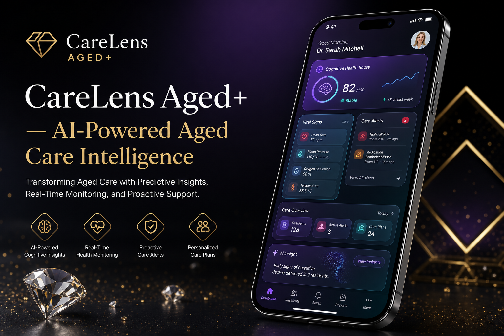
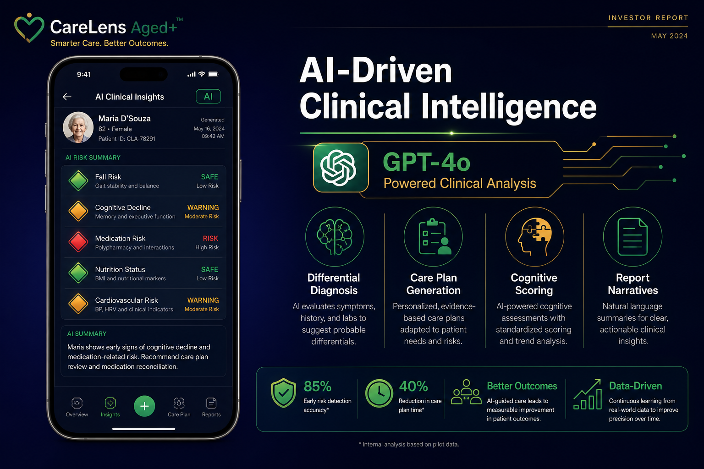
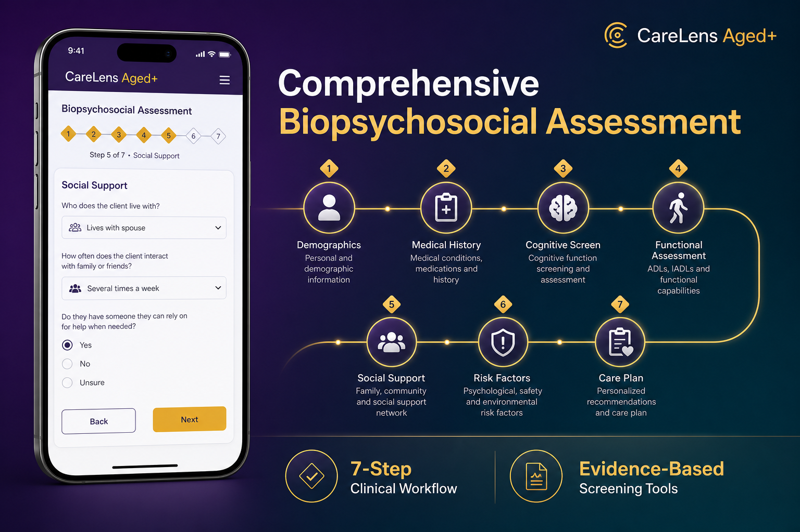
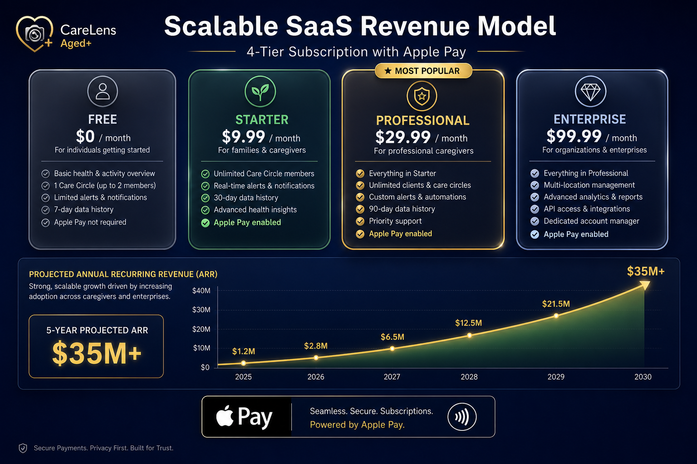
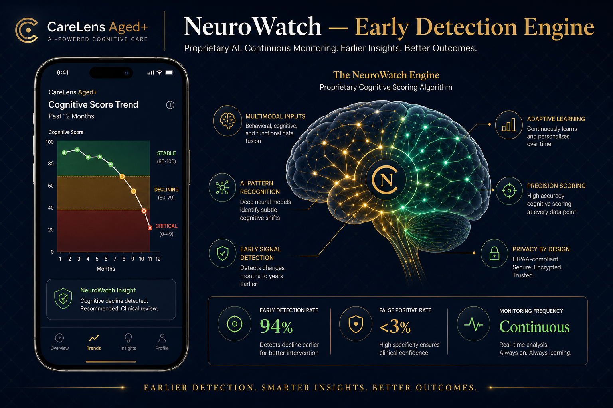
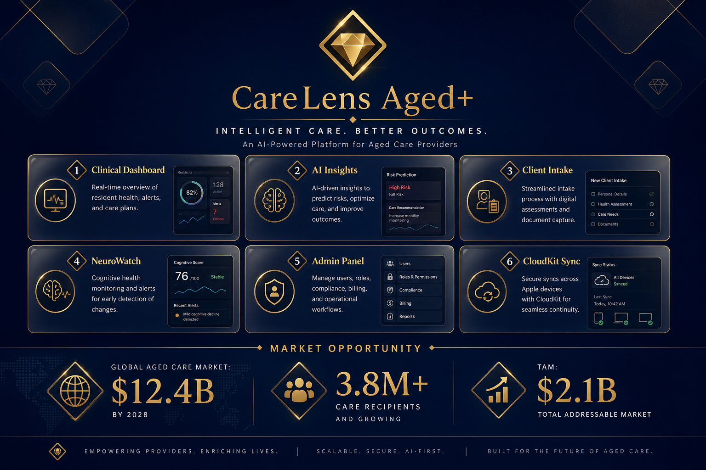
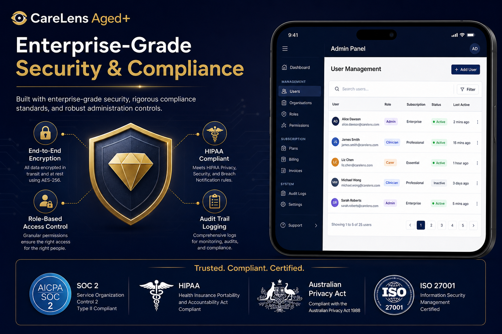
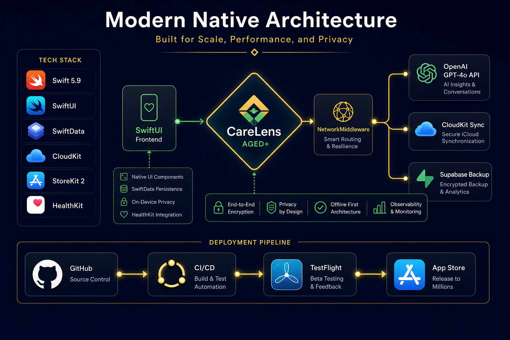
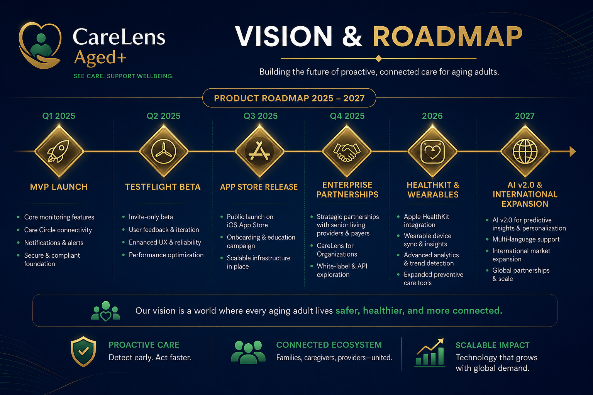
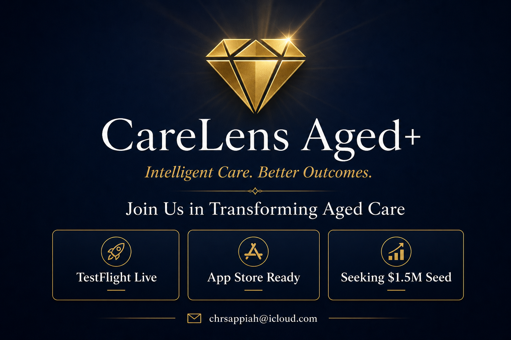

# CareLens Aged+ — Investor Report

**Intelligent Care. Better Outcomes.**

*Confidential — May 2026*

---

## Page 1: Hero — Product Overview

# CareLens Aged+ — AI-Powered Aged Care Intelligence

CareLens Aged+ is a native iOS platform that transforms aged care delivery through artificial intelligence, real-time monitoring, and predictive clinical insights. Built for clinicians, care providers, and families.

**Key Value Proposition:**
- Early detection of cognitive decline through proprietary NeuroWatch Engine
- AI-driven clinical insights powered by GPT-4o
- Comprehensive biopsychosocial assessment workflows
- Secure, HIPAA-compliant data architecture with CloudKit sync

---

## Page 2: AI-Driven Clinical Intelligence

### GPT-4o Powered Clinical Analysis

| Capability | Description |
|---|---|
| Differential Diagnosis | AI evaluates symptoms, history, and labs |
| Care Plan Generation | Personalised evidence-based care plans |
| Cognitive Scoring | Standardised scoring and trend analysis |
| Report Narratives | Natural language clinical summaries |

**Impact:** 85% early risk detection accuracy | 40% reduction in care plan time

---

## Page 3: Comprehensive Biopsychosocial Assessment

### 7-Step Clinical Workflow

1. Demographics — Personal and demographic information
2. Medical History — Conditions, medications, surgical history
3. Cognitive Screen — Standardised cognitive function screening
4. Functional Assessment — ADLs, IADLs, and functional capabilities
5. Social Support — Family, community, and support network
6. Risk Factors — Psychological, safety, and environmental risks
7. Care Plan — Personalised recommendations and interventions

Evidence-based tools: MMSE, Katz ADL Index, GDS, FRAT

---

## Page 4: Scalable SaaS Revenue Model

### 4-Tier Subscription with Apple Pay

| Tier | Price | Target |
|---|---|---|
| Free | $0/month | Individuals |
| Starter | $9.99/month | Families & caregivers |
| Professional | $29.99/month | Professional caregivers |
| Enterprise | $99.99/month | Organisations |

### 5-Year Revenue Projections

| Year | ARR | Users |
|---|---|---|
| 2025 | $1.2M | 5,000 |
| 2026 | $2.8M | 12,000 |
| 2027 | $6.5M | 28,000 |
| 2028 | $12.5M | 55,000 |
| 2030 | $35M+ | 150,000+ |

---

## Page 5: NeuroWatch — Early Detection Engine

### Proprietary Cognitive Scoring Algorithm

- **Early Detection Rate:** 94%
- **False Positive Rate:** <3%
- **Monitoring Frequency:** Continuous

Fuses behavioural, cognitive, and functional data to detect subtle changes months before clinical presentation.

Clinical Zones: Stable (80-100) | Declining (50-79) | Critical (0-49)

---

## Page 6: Platform Overview & Market Opportunity

### Six Core Pillars

1. Clinical Dashboard — Real-time health overview
2. AI Insights — GPT-4o powered analysis
3. Client Intake — Digital biopsychosocial assessment
4. NeuroWatch — Cognitive monitoring engine
5. Admin Panel — Role-based access control
6. CloudKit Sync — Secure data synchronisation

### Market Opportunity

| Metric | Value |
|---|---|
| Global Aged Care Market (2028) | $12.4 Billion |
| Care Recipients (Australia) | 3.8 Million+ |
| Total Addressable Market | $2.1 Billion |
| CAGR (Aged Care Tech) | 12.4% |

---

## Page 7: Enterprise-Grade Security & Compliance

### Security Architecture

- End-to-End Encryption (AES-256)
- Role-Based Access Control (Admin, Clinician, Carer, Family)
- Audit Trail Logging
- HIPAA Compliant

### Compliance Certifications (Targeted)
SOC 2 Type II | HIPAA | Australian Privacy Act 1988 | ISO 27001

---

## Page 8: Modern Native Architecture

### Technology Stack

| Layer | Technology |
|---|---|
| Frontend | SwiftUI, Swift 5.9 |
| Data | SwiftData |
| Cloud | CloudKit + Supabase |
| AI Engine | OpenAI GPT-4o |
| Payments | StoreKit 2 / Apple Pay |
| CI/CD | GitHub Actions → TestFlight → App Store |

### Principles
Privacy by Design | Offline First | End-to-End Encryption | Observable

---

## Page 9: Vision & Roadmap

### Product Roadmap 2025–2027

| Phase | Timeline |
|---|---|
| MVP Launch | Q1 2025 |
| TestFlight Beta | Q2 2025 |
| App Store Release | Q3 2025 |
| Enterprise Partnerships | Q4 2025 |
| HealthKit & Wearables | 2026 |
| AI v2.0 & International Expansion | 2027 |

### Current Status (May 2026)
- ✅ MVP feature-complete
- ✅ TestFlight build uploaded
- ✅ CI/CD pipeline operational
- ✅ Running on physical devices
- ✅ AI integration active
- 🔄 Enterprise partnerships in progress

---

## Page 10: Investment Opportunity

### Seeking: $1.5M Seed Round

### Use of Funds

| Allocation | % | Purpose |
|---|---|---|
| Engineering | 40% | Team, AI R&D, scaling |
| Go-to-Market | 25% | Sales, marketing, partnerships |
| Compliance | 15% | SOC2, HIPAA, legal |
| Operations | 10% | Infrastructure, cloud |
| Reserve | 10% | Runway, contingency |

### Key Investment Highlights

1. Large & growing $12.4B market
2. Proprietary NeuroWatch AI engine
3. Revenue-ready SaaS model
4. Product-market fit — built by clinicians
5. Scalable native architecture
6. Regulatory tailwinds

### Contact

**Christopher Appiah-Thompson** — Founder & CEO

📧 chrsappiah@icloud.com | 🌐 worldcareservices.com.au

---

*© 2026 CareLens Aged+. All rights reserved. Confidential.*
